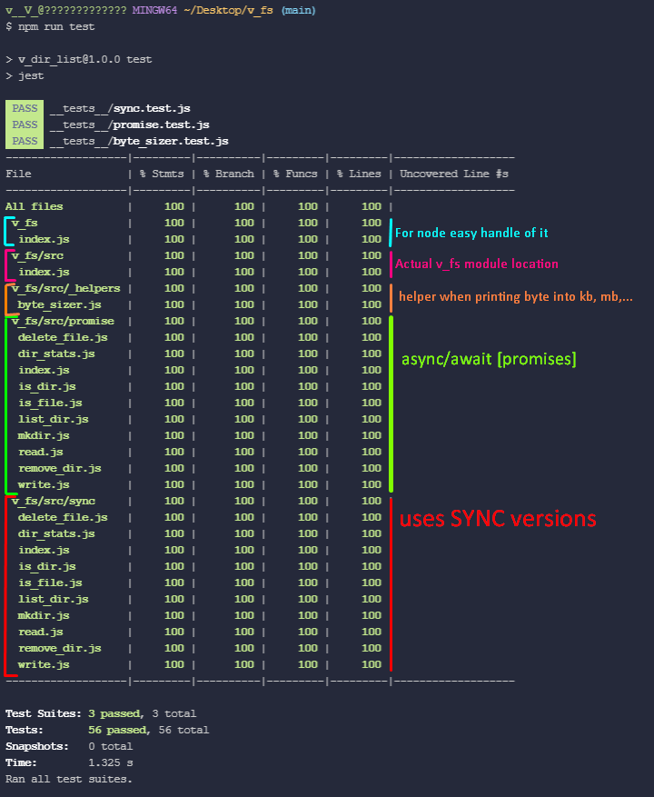

# 🔽 v_fs 
 - 
> **[.v.]** *Node Module* File System Handler

## ➿ How To Install  

Add this repo git URL into dependencies in your projects package.json.  

    ...
    "dependencies": {
      "v_fs":"https://github.com/V-core9/v_fs.git"  
    },
    ...

## 🎮 How to use  

Well just load it as a constant...

    ...
    
    const v_fs = require('v_fs');

    console.log(v_fs.version());

    // ASYNC LIST - - - -
    // Make Directory 
    v_fs.mkdir(path, options = {}, callback = null) ;

    // Write Content To File
    v_fs.write(filePath, content,  callback = null, encoding = 'utf8') ;
    
    // SYNC LIST - - - -
    // Make Directory
    v_fs.mkdirSync(path, recurse = false) ;

    // Write Content To File
    v_fs.writeSync(filePath, content, encoding = 'utf8') ;
    
    ...

## ✅ Test Results and Coverage with Jest

---

### 👻 Author: **-<[\_.⟁.\_]>-**  

### ⏰ CreatedTime: 11.08.2021 @ 21:51  
