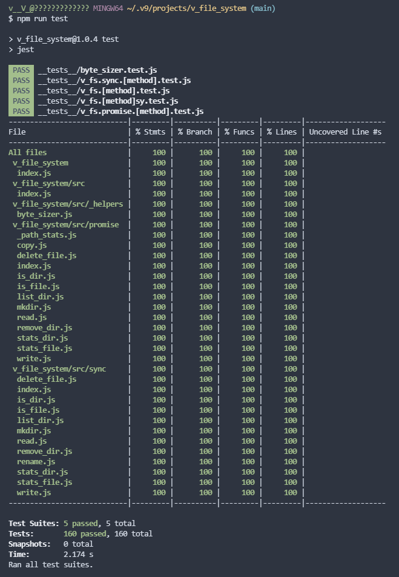

# 🔽 v_file_system => v_fs 
 
> **[.v.]** *Node Module* File System Handler

## ➿ How To Install  

Add this repo git URL into dependencies in your projects package.json.  

    ...
    "dependencies": {
      "v_fs":"https://github.com/V-core9/v_fs.git"  
    },
    ...

## 🎮 How to use  

Well just load it as a constant...

    ...
    
    const v_fs = require('v_file_system');

    // ASYNC  - - - -    
    // v_fs.{methodName}
    v_fs.mkdir(path, options = {}) ;
    v_fs.write(filePath, content, encoding = 'utf8') ;
    v_fs.deleteFile (filePath);
    v_fs.isDir (dirPath);
    v_fs.isFile (filePath);
    v_fs.mkdir (path, options = {});
    v_fs.read (filePath,  encoding = "utf8");
    v_fs.removeDir (dirPath, options = {recursive: true});
    v_fs.statsDir (dirPath);
    v_fs.statsFile (filePath);
 
    // v_fs.promise.{methodName}
    v_fs.promise.mkdir(path, options = {}) ;
    v_fs.promise.write(filePath, content, encoding = 'utf8') ;
    v_fs.promise.deleteFile (filePath);
    v_fs.promise.isDir (dirPath);
    v_fs.promise.isFile (filePath);
    v_fs.promise.mkdir (path, options = {});
    v_fs.promise.read (filePath,  encoding = "utf8");
    v_fs.promise.removeDir (dirPath, options = {recursive: true});
    v_fs.promise.statsDir (dirPath);
    v_fs.promise.statsFile (filePath);
    
    // SYNC    
    // v_fs.{methodName + "Sy"}  - - - -
    v_fs.mkdirSy (path, options = {}) ;
    v_fs.writeSy (filePath, content, encoding = 'utf8') ;
    v_fs.deleteFileSy (filePath);
    v_fs.isDirSy (dirPath);
    v_fs.isFileSy (filePath);
    v_fs.mkdirSy (path, options = {});
    v_fs.readSy (filePath,  encoding = "utf8");
    v_fs.removeDirSy (dirPath, options = {recursive: true});
    v_fs.statsDirSy (dirPath);
    v_fs.statsFileSy (filePath);

    // v_fs.sync.{methodName}
    v_fs.sync.mkdir(path, options = {}) ;
    v_fs.sync.write(filePath, content, encoding = 'utf8') ;
    v_fs.sync.deleteFile (filePath);
    v_fs.sync.isDir (dirPath);
    v_fs.sync.isFile (filePath);
    v_fs.sync.mkdir (path, options = {});
    v_fs.sync.read (filePath,  encoding = "utf8");
    v_fs.sync.removeDir (dirPath, options = {recursive: true});
    v_fs.sync.statsDir (dirPath);
    v_fs.sync.statsFile (filePath);
    
    // ByteSizer - - - -     
    v_fs.byteSizer.byteToKilo(size)
    v_fs.byteSizer.byteToMega(size)
    v_fs.byteSizer.byteToGiga(size)
    v_fs.byteSizer.byteToTera(size)
    v_fs.byteSizer.kiloToByte(size)
    v_fs.byteSizer.kiloToMega(size)
    v_fs.byteSizer.kiloToGiga(size)
    v_fs.byteSizer.kiloToTera(size)
    v_fs.byteSizer.megaToByte(size)
    v_fs.byteSizer.megaToKilo(size)
    v_fs.byteSizer.megaToGiga(size)
    v_fs.byteSizer.megaToTera(size)
    v_fs.byteSizer.gigaToByte(size)
    v_fs.byteSizer.gigaToKilo(size)
    v_fs.byteSizer.gigaToMega(size)
    v_fs.byteSizer.gigaToTera(size)
    v_fs.byteSizer.teraToByte(size)
    v_fs.byteSizer.teraToKilo(size)
    v_fs.byteSizer.teraToMega(size)
    v_fs.byteSizer.teraToGiga(size)

    ...

## ✅ Test Results and Coverage with Jest

---

## 🩺 Sync[vs]Async Write&Delete Speed

| FileCount      | sw | aw | sw/aw | sd | ad | sd/ad |
| ----------- | ----------- | ----------- | ----------- | ----------- | ----------- | ----------- |
| 2,000      | 1.325s       | 0.068s       | **19.4x**       | 0.954s       | 0.033s       | **28.9x**       |
| 15,000   | 9.904s        | 0.316s       | **31.3x**       | 7.430s       | 0.208s       | **35.7x**       |
| 50,000   | 33.807s        | 0.861s       | **39.2x**       | 22.318s       | 0.765s       | **29.1x**       |

[ sw / aw - Divide SyncWrite with AsyncWrite   ]
[ sd / ad  - Divide SyncDelete with AsyncDelete ]

---

### 👻 Author: **-<[\_.⟁.\_]>-**  

### ⏰ CreatedTime: 11.08.2021 @ 21:51  
